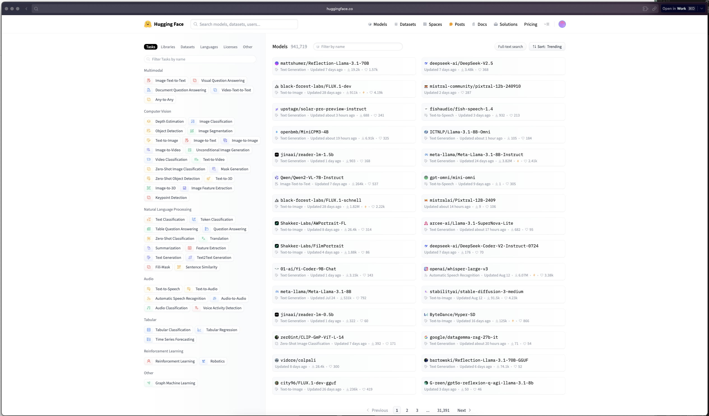
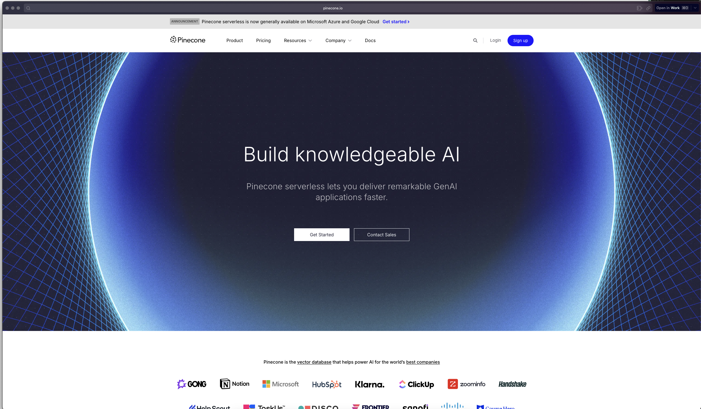

# Bienvenidos

En este repositorio encontraran una serie de ligas que pueden ser de interes y de utilidad a la otra de estar desarrollando su reto para el HackMty 2024.

## Reto Softtek

En este reto de Softtek, impulsado por Intel, estamos buscando desarrollar casos prácticos para AI, específicamente Gen AI y Computer Vision, o una combinación de ambas, con el objetivo de resolver problemas reales, incrementar la productividad y generar un impacto positivo en las empresas. Intel OpenVINO y Softtek FRIDA actuarán como facilitadores.
FRIDA, nuestra plataforma empresarial de Gen AI, fue diseñada con varios objetivos en mente: abordar problemas multidominio, incluyendo aceleradores a lo largo de todo el SDLC, escalabilidad en Conversational AI y casos de uso verticalizados. OpenVINO nos permite aprovechar al máximo el hardware Intel, permitiendo realizar inferencias de AI en laptops y servidores sin necesidad de GPUs dedicadas, democratizando así estas tecnologías.
El reto para los equipos interesados consiste en encontrar un caso de uso para la AI e implementarlo utilizando el potencial de OpenVINO y FRIDA, con un enfoque especial en Gen AI y Computer Vision (o ambos). Los jueces evaluarán el caso de uso y su implementación basándose en los siguientes criterios:

- Originalidad del caso de uso.
- Impacto del caso de uso en la productividad y en los resultados económicos de las empresas.
- Innovación tecnológica y uso adecuado de la tecnología para resolver el problema.
- Utilización de OpenVINO o Intel NPUs.
- Calidad del código en el repositorio.
- Experiencia del demo.

Se otorgarán puntos adicionales por aprovechar características recientes como Paged Attention, Dynamic Split Fuse o Continuous Batching.

## APIs

<p align="center">
  
</p>

### URLs

- Base URL

  <https://fridaplatform.com>

- Basic inference (Postman):​

  <https://fridaplatform.com/generate​>

​

- Usage with SDK OpenAI:​

  <https://fridaplatform.com/v1>

### Ejemplo

```python
from openai import OpenAI
client = OpenAI(
    api_key="-",
    base_url="https://fridaplatform.com/v1"
)
response = client.chat.completions.create(
  model="tgi",
    messages=[
    {"role": "system", "content": "You are a helpful assistant."},
    {"role": "user", "content": "Who won the world series in 2020?"},
    {"role": "assistant", "content": "The Los Angeles Dodgers won the World Series in 2020."},
    {"role": "user", "content": "Where was it played?"}
  ],stream=False
)
```

## Tecnologías que pueden ser de valor

<p align="center">
  
</p>

## OpenAI

OpenAI es una organización de investigación en inteligencia artificial sin fines de lucro que tiene como objetivo promover y desarrollar inteligencia artificial.

Una de las cosas de valor de OpenAI es su mas reciente SDK para Python, el cual permite a los desarrolladores de Python interactuar con las APIs de manera mas amigable. En particular para el reto y las ligas compartidas se van a estar utilizando las capacidades de generación de texto.

[Documentación OpenAI SDK](https://platform.openai.com/docs/overview)

<p align="center">
  
</p>

## Langchain

Langchain es una plataforma de generación de lenguaje natural que permite a los desarrolladores crear aplicaciones de lenguaje natural de alta calidad en minutos. Langchain es una plataforma de generación de lenguaje natural que permite a los desarrolladores crear aplicaciones de lenguaje natural de alta calidad en minutos.

[Documentación Langchain](https://docs.langchain.com/)

<p align="center">
  
</p>

## LlamaIndex

LlamaIndex es una plataforma alternativa a Langchain que de la misma manera permite desarrollar aplicaciones de Inteligencia Aritifical generativa de manera muy amigable

[Documentación LlamaIndex](https://docs.llamaindex.ai/en/stable/)

<p align="center">
  
</p>

## Hugging Face

Hugging Face es una organización que se dedica a desarrollar modelos de inteligencia artificial y a ponerlos a disposición de la comunidad de manera gratuita. En particular, Hugging Face es conocido por su plataforma de transformers.

[Documentación Hugging Face General](https://huggingface.co/docs/)

[Documentación HF Modelos](https://huggingface.co/models)

<p align="center">
  
</p>

## ChromaDB

ChromaDB es una base de datos de código abierto que permite a los desarrolladores almacenar y recuperar datos de manera eficiente.

[Documentación ChromaDB](https://docs.trychroma.com/)

<p align="center">
  
</p>

## Pinecone

Pinecone es una plataforma de búsqueda y recuperación de vectores en tiempo real. Permite a los desarrolladores construir aplicaciones de búsqueda y recomendación de alto rendimiento.

[Documentación Pinecone](https://docs.pinecone.io/home)

<p align="center">
  
</p>

## OpenVino

OpenVINO es un kit de herramientas de software de código abierto que permite a los desarrolladores acelerar la implementación de modelos de inteligencia artificial y visión por computadora en hardware Intel.

[Documentación OpenVino](https://docs.openvino.ai/2024/index.html)

<p align="center">
  
</p>

## FastAPI

FastAPI es un marco web moderno y rápido (de alto rendimiento) para crear API con Python 3.6+ basado en estándares de tipo de Python (usando Pydantic) y estándares de OpenAPI.

[Documentación FastAPI](https://fastapi.tiangolo.com/)

<p align="center">
  
</p>
